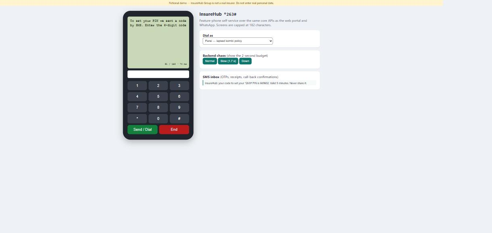

# InsureHub USSD — feature-phone self-service (`*263#`)


**Status:** ✅ v0.1.0 built and tested (2026-10-01) · 37 tests · live demo: *pending deploy* · **Stack rotation slot:** C#
**Stack:** .NET 8 · ASP.NET Core minimal APIs · Redis (sessions) · Polly (timeouts, circuit breakers) · declarative menu engine (JSON) · JSON localisation (English, Shona, Ndebele) · xUnit + WebApplicationFactory + Testcontainers · OpenTelemetry · vanilla JS phone simulator · Docker (multi-arch)

**Author:** Simbarashe Nyamusa, Senior Software Engineer

Customers without smartphones or data dial **`*263#`** to check policies, pay premiums by EcoCash, check claims and loans, and request a call-back. It reuses the same core APIs as the web portal and the WhatsApp assistant (channel-agnostic core, principle P6).

## Why this project
- Hiring managers at Zimbabwean insurers, banks and telcos recognise USSD straight away, and I built USSD-adjacent systems at TelOne (EcoCash/TelPay payment flows).
- It's a quick win: 1–2 weekends, since the APIs already exist.
- It shows a different engineering problem: **hard real-time limits** (the aggregator times out in seconds), **182-character screens**, and stateful sessions over a stateless protocol.

## Run it

```bash
docker compose up --build          # gateway + Redis → simulator at http://localhost:5300
dotnet test                        # 37 tests (Docker needed for the Redis test)
```



**Demo (90 s):** dial as *Farai* → 2 Pay premium → enter the SMS code → set PIN 4826 twice → 1 (the kombi policy) → 1 Pay USD 187.20 → 1 Yes → receipt arrives by SMS. Then press **Down** under *Backend chaos*, dial again → answers come from cache or end with "we'll SMS you" within 2 s. Dial as *Nyasha* to see the SIM-swap block; 6 → 2 switches to Shona.

Aggregator callback: `POST /ussd` (form `sessionId`, `phoneNumber`, `text`, `serviceCode`, `networkCode`) with header `X-Ussd-Secret`; responds `CON …` / `END …`.

## Documentation (the full lifecycle)

| Stage | Document |
|---|---|
| Business case | [docs/01-concept-paper.md](docs/01-concept-paper.md) |
| Requirements | [docs/02-requirements.md](docs/02-requirements.md) |
| Design | [docs/03-architecture.md](docs/03-architecture.md), [docs/adr/](docs/adr/) |
| Security | [docs/04-security-and-compliance.md](docs/04-security-and-compliance.md) |
| Testing | [docs/05-test-strategy.md](docs/05-test-strategy.md) |
| Delivery | [docs/06-delivery-plan.md](docs/06-delivery-plan.md), [CHANGELOG.md](CHANGELOG.md) |
| Verification | [docs/07-traceability.md](docs/07-traceability.md) |
| Test cases | [docs/09-test-cases.md](docs/09-test-cases.md): every test case with its requirement and last result |
| Operations | [docs/08-operations.md](docs/08-operations.md) |

## Planning pack (original)

| Document | Contents |
|---|---|
| [docs/01-concept-paper.md](docs/01-concept-paper.md) | why USSD, options, recommendation |
| [docs/02-requirements.md](docs/02-requirements.md) | menu tree, stories, constraints, NFRs |
| [docs/03-architecture.md](docs/03-architecture.md) | callback contract, session design, menu engine, resilience |
| [docs/04-security-and-compliance.md](docs/04-security-and-compliance.md) | PIN, SIM-swap risk, data exposure on shared phones |
| [docs/05-test-strategy.md](docs/05-test-strategy.md) | flow tests, screen-length property, latency tests |
| [docs/06-delivery-plan.md](docs/06-delivery-plan.md) | plan and demo script |
| [docs/adr/](docs/adr/) | decisions |
