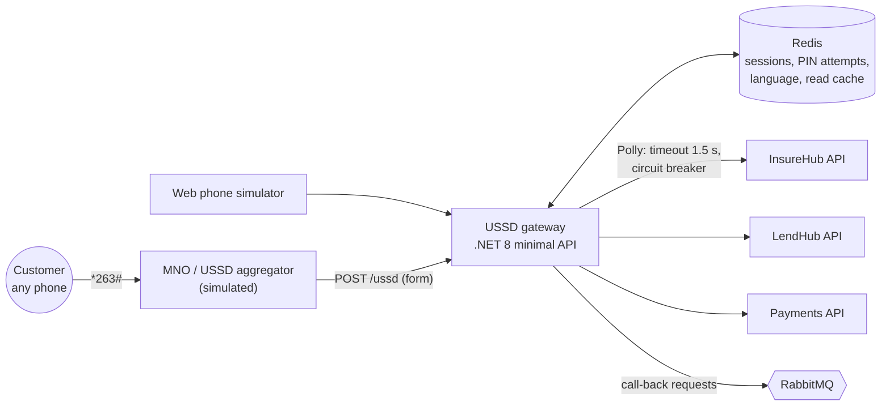

# InsureHub USSD — architecture

## 1. Context



## 2. Callback contract

Request (`application/x-www-form-urlencoded`): `sessionId`, `serviceCode`, `phoneNumber`, `networkCode`, `text`.
`text` is the whole input history joined by `*`, e.g. `"2*1234*1*1"`.
Response (`text/plain`): `CON <screen>` to continue or `END <screen>` to finish. Anything else ends the session.

The gateway **does not** rebuild state from `text` alone. It keeps a server-side session keyed by `sessionId`, and uses `text` only to take the latest input. This protects against aggregators that resend or truncate history (ADR-0002).

## 3. Menu engine

Menus are declared as data (`menus/*.json`): nodes with a type (`menu`, `input`, `pin`, `confirm`, `action`, `end`), localised text keys, validation, transitions and an optional handler.

```json
{ "id": "pay.confirm", "type": "confirm",
  "text": "pay.confirm.text",            // "Pay {amount} for {policy}? 1.Yes 2.No"
  "on": { "1": "pay.execute", "2": "main" },
  "handler": "PreparePremiumPayment" }
```

- A `MenuRuntime` walks the graph; handlers are small C# classes (`IMenuHandler`) that call the APIs.
- Localised strings live in resx files (EN/SN/ND); a build-time check fails if any key is missing in any language or any rendered screen goes over 182 characters with realistic data.
- Adding a menu means changing data and one handler, with no changes to the engine.

## 4. Session

| Key | Contents | TTL |
|---|---|---|
| `ussd:s:{sessionId}` | current node, collected inputs, customerRef, pinVerified, pending payment | 180 s |
| `ussd:lang:{msisdn}` | language | 1 year |
| `ussd:pin:{msisdn}` | failed attempts, lock-until | 30 min |
| `ussd:cache:{customerRef}:policies` | trimmed policy list | 60 s |

PIN hashes are stored in the gateway's PostgreSQL schema (Argon2id), not Redis.

## 5. Resilience (the 2-second budget)

```
aggregator budget ~2 s
├── gateway overhead         ≤ 50 ms
├── backend call             ≤ 1.5 s (Polly timeout)
│     └── on timeout: serve 60 s cache if present,
│         else END "We're busy. We'll SMS you your balance." → async job sends SMS
└── render + respond         ≤ 50 ms
```

Circuit breaker per backend; the main menu never calls a backend, so it always renders.

## 6. Observability
Spans per request with `ussd.node`, `ussd.language`, `network`; metrics: sessions started/completed, drop-off per node, p99 latency, timeouts per backend.
